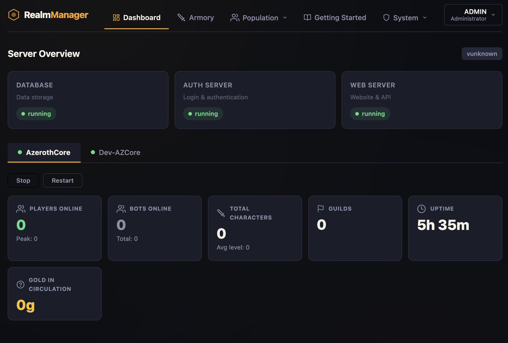
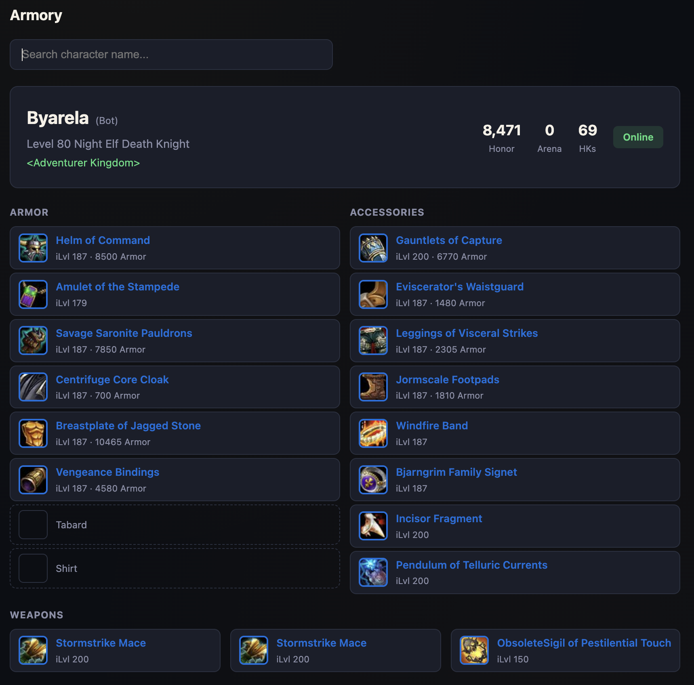
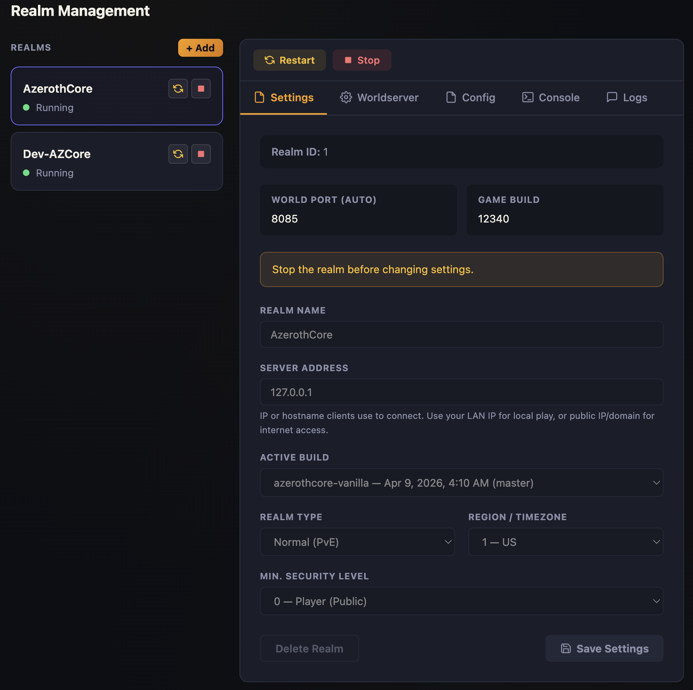
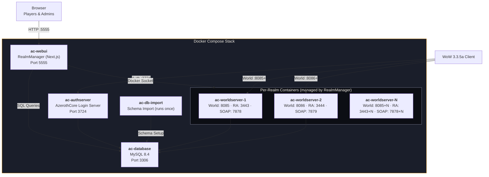

# RealmManager

A complete web-based management platform for AzerothCore WoW private servers. RealmManager handles the full lifecycle — from building server images from source, to player self-service registration and armory lookup — all from a single Docker Compose stack.

<!-- Screenshots — replace with actual captures when available -->

| Dashboard | Armory | Realm Console |
|:---------:|:------:|:-------------:|
|  |  |  |

> **Note:** Screenshots are placeholders. Replace with actual captures of your running instance.

---

## What It Does

### For Server Operators

- **Build from source** — clone any AzerothCore fork, apply modules, and produce Docker images without touching the command line
- **Multi-realm management** — spin up multiple independent worldservers, each with isolated databases and configurations
- **Live controls** — start, stop, restart realms; stream logs in real time; send console commands via the RA protocol
- **Config editor** — edit worldserver configuration files directly from the browser
- **Manifest system** — declarative YAML recipes define builds, modules, extra databases, and environment variables per source
- **Custom branding** — rename the UI, swap colors, set logos and favicons to match your server identity
- **Account administration** — view all accounts, set GM levels, manage access
- **Settings dashboard** — database config, GitHub tokens for private repos, auth settings, source management

### For Players

- **Self-service signup** — create a game account from the web without admin intervention
- **Password management** — change passwords through the web UI
- **Armory** — search characters across all realms, view level, race, class, guild, honor, and arena stats
- **Who's online** — see players currently connected to each realm
- **Guild browser** — browse guilds and their rosters per realm
- **Character services** — request faction change, race change, or appearance customization (applied at next login)
- **Getting started guide** — step-by-step instructions for connecting a WoW 3.3.5a client, customizable by the server operator

---

## Architecture



### Key Relationships

| Component | Role | Talks To |
|-----------|------|----------|
| **ac-webui** | Next.js app — serves the UI, runs API routes, manages realm lifecycle | MySQL (queries), Docker socket (container control) |
| **ac-database** | MySQL 8.4 — stores auth, world, and character data for all realms | — |
| **ac-authserver** | AzerothCore login server — authenticates WoW clients | MySQL (auth DB) |
| **ac-worldserver-N** | One per realm — runs the game world | MySQL (world/characters DBs) |
| **ac-db-import** | Runs once at startup to apply database schemas | MySQL |

### Database Layout

```
ac-database (MySQL 8.4)
├── acore_auth            ← Shared across all realms (accounts, realmlist)
├── acore_world           ← Realm 1 world data (or acore_world_N for realm N)
├── acore_characters      ← Realm 1 character data (or acore_characters_N for realm N)
└── acore_playerbots_N    ← Extra databases from manifests (per-realm)
```

### Port Map

| Service | Realm 1 | Realm 2 | Realm N |
|---------|---------|---------|---------|
| World   | 8085    | 8086    | 8085 + N-1 |
| RA      | 3443    | 3444    | 3443 + N-1 |
| SOAP    | 7878    | 7879    | 7878 + N-1 |

---

## Quick Start

### 1. Clone the Repository

```bash
git clone https://github.com/kwilliams312/RealmManager.git
cd RealmManager
```

### 2. Configure Environment

```bash
cp .env.example .env
```

Edit `.env` and set these values **before your first `docker compose up`**:

| Variable | Default | Description |
|---|---|---|
| `DOCKER_DB_ROOT_PASSWORD` | `password` | MySQL root password. **Change this for production.** |
| `WEBUI_SECRET_KEY` | `realmmanager-default-secret...` | Session encryption key. **Must be at least 32 characters. Change this for production.** |

### 3. Start the Stack

```bash
docker compose up -d
```

This starts:
- **MySQL** database
- **AzerothCore Auth Server** (login server)
- **RealmManager Web UI** on port 5555

### 4. First-Run Setup

Visit `http://localhost:5555` — the setup wizard will guide you through:

1. **Create Admin Account** — username and password for the game server and web UI
2. **Server Build** — the vanilla AzerothCore source is built automatically. This takes several minutes on first run.

After setup, log in and create your first realm from the **Realms** page.

---

## Configuration Reference

All configuration is via `.env` file in the project root.

| Variable | Default | Description |
|---|---|---|
| `DOCKER_DB_ROOT_PASSWORD` | `password` | MySQL root password |
| `DOCKER_DB_EXTERNAL_PORT` | `3306` | External MySQL port |
| `AC_AUTHSERVER_IMAGE` | `acore/ac-wotlk-authserver:master` | Auth server Docker image |
| `AC_DB_IMPORT_IMAGE` | `acore/ac-wotlk-db-import:master` | DB import Docker image |
| `AC_CLIENT_DATA_IMAGE` | `acore/ac-wotlk-client-data:master` | Client data (maps/dbc) image |
| `WEBUI_SECRET_KEY` | *(insecure default)* | Session encryption key (>=32 chars) |
| `DOCKER_WEBUI_EXTERNAL_PORT` | `5555` | Web UI port |
| `DOCKER_AUTH_EXTERNAL_PORT` | `3724` | Auth server port |
| `REALM_HOST_DIR` | `./data/realms` | Host path for realm data |
| `COMPOSE_PROJECT_NAME` | `realmmanager` | Docker compose project name |

---

## Managing Realms

### Build Sources

RealmManager ships with two pre-configured sources:

- **AzerothCore (Vanilla)** — standard AzerothCore WotLK
- **AzerothCore + Playerbots** — AzerothCore with the mod-playerbots module

Go to **Builds** to trigger a build, then create a realm from **Realms** using the built image.

### Source Manifests

Each source has a YAML manifest that declares its build recipe: extra databases, environment variables, module repositories, and build steps. See [Source Manifests Documentation](docs/manifests.md) for details.

Manage manifests from the **Manifests** page in the UI.

### Realm Controls

Start, stop, and restart realms from the **Dashboard** — controls appear in the realm tab header when you select a realm. Each realm has tabs for:

- **Online** — live player list
- **Guilds** — guild browser with rosters
- **Console** — send commands via the RA protocol
- **Logs** — stream worldserver logs in real time
- **Config** — edit worldserver configuration files
- **Settings** — realm-specific settings

---

## Development

### Prerequisites

- Node.js 22+
- Bun (package manager)
- Docker with Compose

### Local Development

```bash
bun install
bun dev
```

The dev server runs on `http://localhost:5555`. You'll need a MySQL instance with AzerothCore databases — set `DB_HOST`, `DB_PORT`, `DB_USER`, `DB_PASS` environment variables.

### Testing

```bash
bun test          # Run all tests
bun test --bail   # Stop on first failure
```

### Other Commands

| Task | Command |
|------|---------|
| Type check | `bun run type-check` |
| Lint | `bun run lint` |
| Build | `bun run build` |
| Docker rebuild | `docker compose up -d --build ac-webui` |

---

## License

This project is licensed under the [GNU Affero General Public License v3.0](LICENSE). See [LICENSE](LICENSE) for the full text.
